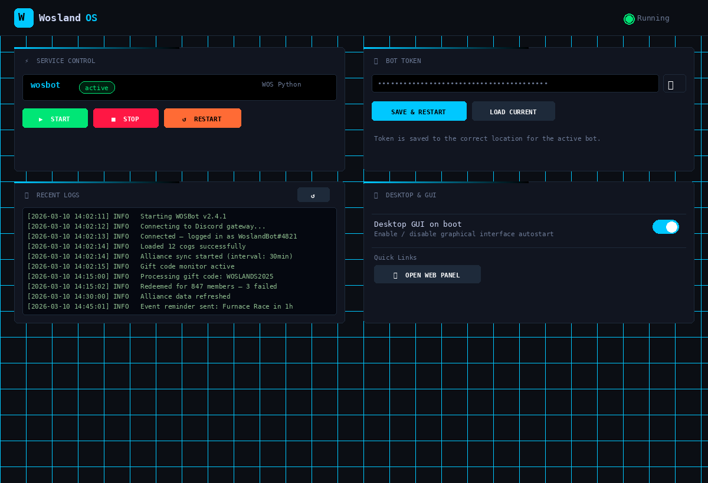
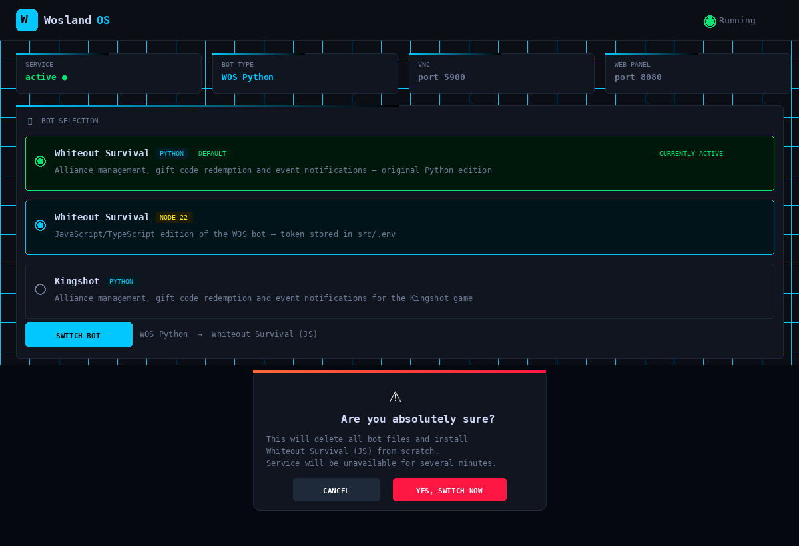

# WoslandOS

Automated Ubuntu-based system images for running self-hosted Discord bots across Raspberry Pi, x86 bare-metal, VMs, and Proxmox LXC containers.

Everything is pre-configured. Flash the image (or run one script on your Proxmox host), boot, and your bot is running within minutes — complete with a desktop GUI, VNC remote access, SSH, and a full web control panel.

---

## Screenshots

> Web control panel — accessible at `http://<machine-ip>:8080` from any browser

### Service Control & Status


### Bot Selection & Switcher


---

## Supported Bots

All three bots can be switched live from the web dashboard — no SSH needed. The bot token is automatically carried over when switching.

| Bot | Language | Default | Token location |
|---|---|---|---|
| **Whiteout Survival** | Python 3 | ✅ Yes | `~/bot/bot_token.txt` |
| **Whiteout Survival JS** | Node.js 22 | No | `~/bot/src/.env` → `TOKEN=` |
| **Kingshot** | Python 3 | No | `~/bot/bot_token.txt` |

---

## System Requirements

### Raspberry Pi

| | Minimum | Recommended |
|---|---|---|
| **Model** | Raspberry Pi 4 (2 GB RAM) | Raspberry Pi 4 / 5 (4 GB+ RAM) |
| **SD card** | 16 GB Class 10 | 32 GB+ A2-rated (U3) |
| **Network** | Wi-Fi or wired | Wired Ethernet |
| **Power supply** | Official 5 V / 3 A USB-C | Official 5 V / 5 A (Pi 5) |

### x86 — Bare Metal or VM

| | Minimum | Recommended |
|---|---|---|
| **CPU** | Any 64-bit dual-core | Quad-core 2 GHz+ |
| **RAM** | 2 GB | 4 GB+ |
| **Disk** | 16 GB | 32 GB+ SSD |
| **Network** | Any wired NIC | Wired 100 Mbit+ |
| **Firmware** | Legacy BIOS or UEFI | UEFI |
| **Architecture** | x86-64 only | x86-64 |

### x86 — Proxmox LXC

| | Minimum | Recommended |
|---|---|---|
| **CPU cores** | 1 | 2 |
| **RAM** | 512 MB | 1–2 GB |
| **Disk** | 10 GB | 20 GB |
| **LXC features** | `nesting=1` enabled | `nesting=1` |
| **Proxmox version** | 7.x+ | 8.x |

> The desktop and VNC run on a virtual framebuffer (Xvfb), so no physical display is required on any platform.

---

## What Gets Installed (all variants)

| Component | Details |
|---|---|
| **OS** | Ubuntu 24.04 LTS — latest point release auto-detected at build time |
| **Desktop** | XFCE4 with WoslandOS wallpaper, autologin as `wosland` |
| **Bot** | Whiteout Survival Python bot by default — switchable via web panel |
| **Node.js** | v22 LTS — pre-installed so you can switch to the JS bot instantly |
| **Web panel** | Flask, port **8080** — service control, token management, bot switcher, logs |
| **VNC** | x11vnc on port **5900** via virtual framebuffer |
| **SSH** | OpenSSH on port **22**, password auth enabled |
| **Desktop shortcut** | `WoslandOS Control Panel` shortcut on the desktop |

---

## Quick Pick — Where to Go

| I want to run this on... | Go here |
|---|---|
| Raspberry Pi 4 or 5 | [wosland-rpi/README.md](wosland-rpi/README.md) |
| Old PC / laptop / bare metal | [wosland-x86/README.md](wosland-x86/README.md) — ISO method |
| Proxmox VM | [wosland-x86/README.md](wosland-x86/README.md) — ISO method |
| Proxmox LXC (lightweight) | [wosland-x86/README.md](wosland-x86/README.md) — LXC method |

---

## Web Control Panel

Open `http://<machine-ip>:8080` in any browser after installation.

| Card | What it does |
|---|---|
| **Service Control** | Start / Stop / Restart the bot service with one click. Shows live status (green = running, red = failed) |
| **Bot Token** | Paste your Discord bot token and click Save. Auto-restarts the service. Writes to the correct file for the currently active bot |
| **Bot Selection** | Choose from three bots. Switching requires two confirmations. Token is carried over automatically. Live progress shown during install |
| **Desktop & GUI** | Toggle XFCE desktop autostart on/off (takes effect on next reboot) |
| **Recent Logs** | Last 80 lines of the bot service journal, auto-refreshing every 15 seconds |

### Switching Bots — Step by Step

1. Select a different bot in the **Bot Selection** card
2. Click **Switch Bot** (only enabled when selection differs from current bot)
3. Read the first warning — click **Continue**
4. Read the second confirmation — click **Yes, Switch Now**
5. Watch the live install log in the progress overlay
6. Dashboard refreshes automatically when done

> Switching completely wipes the current bot directory and installs the new one from scratch. This takes 3–10 minutes depending on the bot and your connection speed.

---

## Default Credentials

| Service | Username | Password |
|---|---|---|
| Linux / SSH | `wosland` | `W0sL@nd` |
| VNC | *(none)* | `W0sL@nd` |
| Web panel | *(no authentication)* | — |

> **Change the password** after first boot: `passwd`

---

## Repository Layout

```
WoslandOS/
├── README.md                           ← You are here
├── LICENSE
├── .gitignore
├── docs/                               ← Screenshots used in READMEs
├── wosland-rpi/                        ← Raspberry Pi (arm64)
│   ├── config.sh                       ← Edit this when URLs/credentials change
│   ├── build.sh                        ← Builds the .img.xz SD card image
│   ├── update-token.sh                 ← CLI token updater (run on the Pi)
│   ├── rootfs-overlay/                 ← Files baked into the image at build time
│   │   ├── etc/systemd/system/
│   │   │   └── wosland-firstboot.service
│   │   └── usr/local/bin/
│   │       ├── wosland-firstboot.sh    ← Runs once on first boot, sets everything up
│   │       └── wosland-switch-bot.sh   ← Called by web panel to switch bots
│   ├── webserver/
│   │   └── app.py                      ← Web control panel (Flask)
│   └── README.md
└── wosland-x86/                        ← x86-64 (bare metal / VM / LXC)
    ├── config.sh                       ← Edit this when URLs/credentials change
    ├── build-iso.sh                    ← Builds an unattended bootable ISO
    ├── build-lxc.sh                    ← Creates and provisions a Proxmox LXC
    ├── iso-builder/                    ← Ubuntu autoinstall (cloud-init) templates
    │   ├── user-data
    │   └── meta-data
    ├── rootfs-overlay/                 ← Files injected into the target system
    │   ├── etc/systemd/system/
    │   │   └── wosland-firstboot.service
    │   └── usr/local/bin/
    │       ├── wosland-provision.sh    ← Full provisioning script (ISO + LXC)
    │       └── wosland-switch-bot.sh   ← Called by web panel to switch bots
    ├── webserver/
    │   └── app.py                      ← Web control panel (Flask)
    └── README.md
```

---

## Customisation

All configurable values live in `config.sh` inside each variant's folder. You only ever need to edit that one file before rebuilding.

```bash
# Raspberry Pi — edit then rebuild
nano wosland-rpi/config.sh
sudo wosland-rpi/build.sh

# x86 ISO — edit then rebuild
nano wosland-x86/config.sh
sudo wosland-x86/build-iso.sh

# x86 LXC — edit then run on Proxmox host
nano wosland-x86/config.sh
sudo wosland-x86/build-lxc.sh
```

Key variables in `config.sh`:

| Variable | Purpose |
|---|---|
| `OS_USERNAME` / `OS_PASSWORD` | Linux user credentials |
| `REPO_BASE` | Base URL for WoslandOS assets |
| `BOT_MAIN_PY` | WOS Python bot main.py URL |
| `BOT_INSTALL_PY` | WOS Python bot install.py URL |
| `BOT_JS_REPO` | WOS JavaScript bot Git repo URL |
| `BOT_KINGSHOT_REPO` | Kingshot bot Git repo URL |
| `DEFAULT_BOT` | Bot installed on first boot: `wos-py` / `wos-js` / `kingshot` |
| `DESKTOP` | Desktop environment: `xfce` / `lxde` / `mate` |
| `UBUNTU_SERIES` | Ubuntu LTS track e.g. `24.04` — 24.xx release auto-detected |
| `WEBSERVER_PORT` | Web panel port (default `8080`) |

---

## License

MIT — see [LICENSE](LICENSE)
